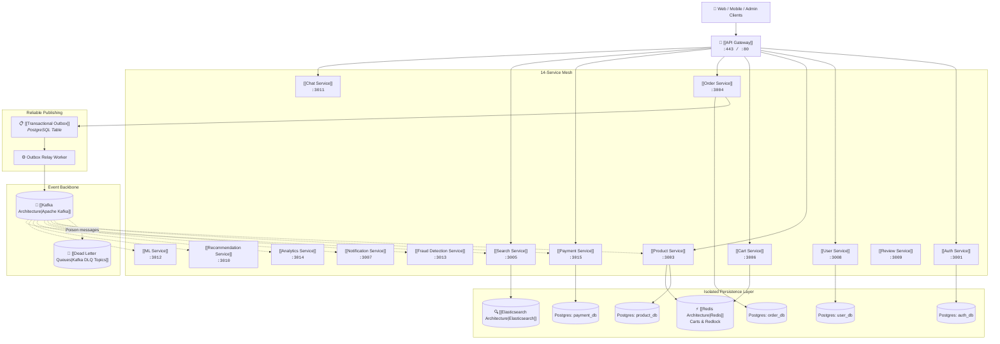

# 🛍️ ShopHub Engineering Knowledge Vault & Migration Playbook

Welcome to the central technical documentation and architectural migration playbook for **ShopHub**, an event-driven e-commerce microservices platform.

> [!abstract] Architectural Status
> - **Current State**: A functional distributed application composed of 14 services, but with several architectural gaps (exposed internal ports, port 3004 collision, silent Kafka failures, and shared database couplings) that prevent it from being classified as production-ready.
> - **Target State**: Gateway-controlled, independently deployable microservices featuring isolated data ownership, transactional outbox reliability, centralized observability, resilient Kafka consumers, and reproducible containerized development.

---

## 🗺️ Documentation Vault Navigation

This vault is organized into distinct engineering domains:

| Section                 | Description                                                        | Key Documents                                                                                                                 |
| ----------------------- | ------------------------------------------------------------------ | ----------------------------------------------------------------------------------------------------------------------------- |
| **01 - Architecture**   | System blueprints, current vs. target state, and ADRs              | [[Target Architecture]], [[Current Architecture]], [[Problem Tracker]], [[System Overview]], [[API Gateway]]                  |
| **02 - Services**       | Complete deep-dive reference for all 14 microservices              | [[Auth Service]], [[Order Service]], [[Payment Service]], [[Product Service]], [[Search Service]]                             |
| **03 - Messaging**      | Apache Kafka architecture, topic catalog, and reliable messaging   | [[Kafka Architecture]], [[Topic Catalog]], [[Transactional Outbox]], [[Dead Letter Queues]]                                   |
| **04 - Data**           | Polyglot persistence, database isolation, Redis, and Elasticsearch | [[PostgreSQL Architecture]], [[Database Isolation]], [[Redis Architecture]], [[Elasticsearch Architecture]]                   |
| **05 - Infrastructure** | Docker containerization, networking, and local setup               | [[Docker Compose]], [[Container Architecture]], [[Environment Variables Matrix]], [[Local Development Setup]]                 |
| **06 - Reliability**    | Resilience patterns, distributed tracing, locks, and idempotency   | [[Correlation IDs]], [[Distributed Locks]], [[Inventory Reservation]], [[Idempotency]], [[Failure Handling]]                  |
| **07 - API**            | Gateway routing rules, auth guards, conventions, and errors        | [[API Gateway Routes]], [[Authentication & Authorization]], [[API Conventions]], [[Error Handling]]                           |
| **08 - Operations**     | Production readiness checklist, monitoring, and runbooks           | [[Production Readiness]], [[Monitoring & Observability]], [[Health Checks]], [[Incident Response]]                            |
| **09 - Roadmap**        | Migration milestones, checklists, and critical issue tracker       | [[Critical Issues]], [[Phase 1 - Critical]], [[Phase 2 - Infrastructure]], [[Phase 3 - Reliability]], [[Migration Checklist]] |
| **99 - Reference**      | Technical glossary and technology stack inventory                  | [[Glossary]], [[Technology Stack]]                                                                                            |

---

## 🎯 Target Architecture Blueprint

The target architecture introduces a unified **API Gateway**, **Transactional Outbox**, **Isolated PostgreSQL Databases**, **Kafka Dead Letter Queues**, and **Redis Distributed Locks**:

---

## 🚨 Architectural Problem Tracker (Quick Summary)

Full tracker details available in [[Problem Tracker]] and [[Critical Issues]]:

| ID            | Issue                                     | Severity    | Affected Services                      | Proposed Resolution                                 |
| ------------- | ----------------------------------------- | ----------- | -------------------------------------- | --------------------------------------------------- |
| **ARCH-001**  | No API Gateway                            | 🔴 Critical | All 14 Services                        | [[API Gateway]], [[API Gateway Routes]]             |
| **ARCH-002**  | Payment / Order Port 3004 Collision       | 🔴 Critical | [[Order Service]], [[Payment Service]] | [[Network & Port Matrix]], [[Phase 1 - Critical]]   |
| **ARCH-003**  | Silent Kafka Publish Drops                | 🔴 Critical | [[Order Service]], [[Payment Service]] | [[Transactional Outbox]], [[Kafka Architecture]]    |
| **ARCH-004**  | Shared `ecommerce_db` PostgreSQL Instance | 🟠 High     | Auth, Product, Order, Notification     | [[Database Isolation]], [[PostgreSQL Architecture]] |
| **INFRA-001** | Missing Master Root Docker Compose        | 🟠 High     | All 14 Services                        | [[Docker Compose]], [[Phase 2 - Infrastructure]]    |
| **REL-001**   | No Distributed Tracing / Correlation IDs  | 🟡 Medium   | All 14 Services                        | [[Correlation IDs]], [[Distributed Tracing]]        |
| **REL-002**   | Inventory Race Conditions                 | 🟡 Medium   | [[Product Service]], [[Cart Service]]  | [[Distributed Locks]], [[Inventory Reservation]]    |
| **REL-003**   | Missing Kafka DLQ on Consumers            | 🟡 Medium   | All Kafka Consumers                    | [[Dead Letter Queues]], [[Retry Strategy]]          |
