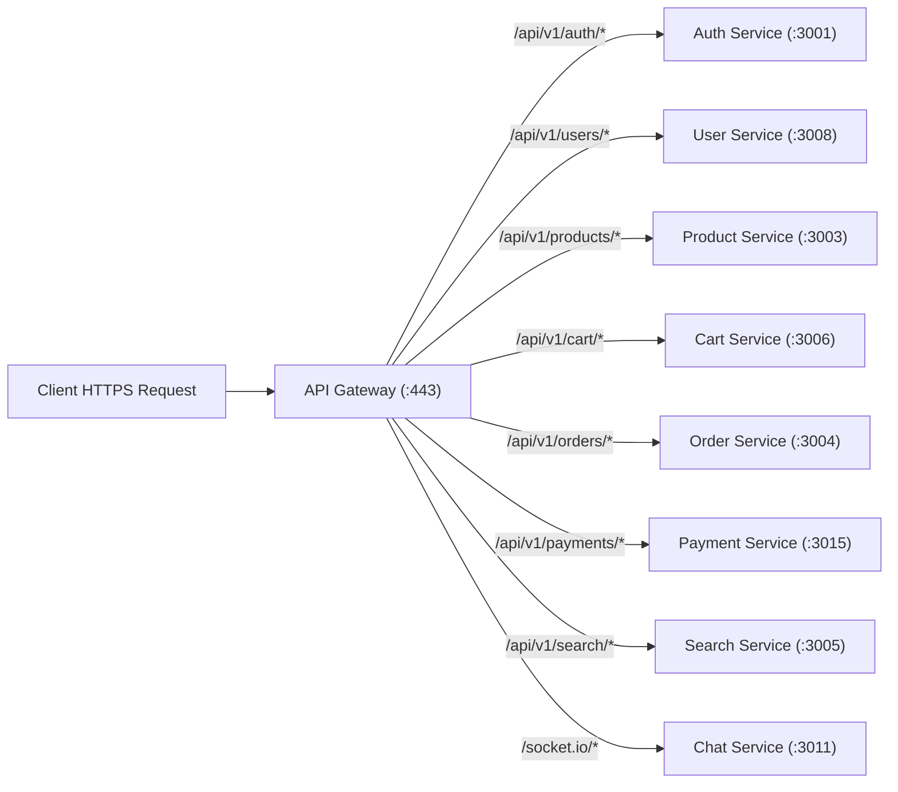

# 🚪 API Gateway Architecture

The **API Gateway** is the single ingress point in the [[Target Architecture]], resolving **ARCH-001**. It eliminates direct client exposure to internal microservices ports.

---

## 🎯 Responsibilities

1. **Single Entry Point**: Listens on ports `80` and `443`; routes traffic to backend services.
2. **Authentication Offload**: Validates Bearer JWT access tokens and injects verified headers:
   - `X-User-Id`: UUID of the authenticated caller
   - `X-User-Role`: `customer`, `seller`, or `admin`
3. **Rate Limiting & Throttling**: Implements IP and user-based token bucket rate limiting via Redis.
4. **CORS Centralization**: Handles pre-flight `OPTIONS` requests centrally.
5. **Request Correlation**: Generates and injects `X-Correlation-ID` if not provided.

---

## 🔀 Route Routing Rules

---

## 🔗 Related Documents
- [[API Gateway Routes]]
- [[Authentication & Authorization]]
- [[Target Architecture]]
- [[Critical Issues]]
