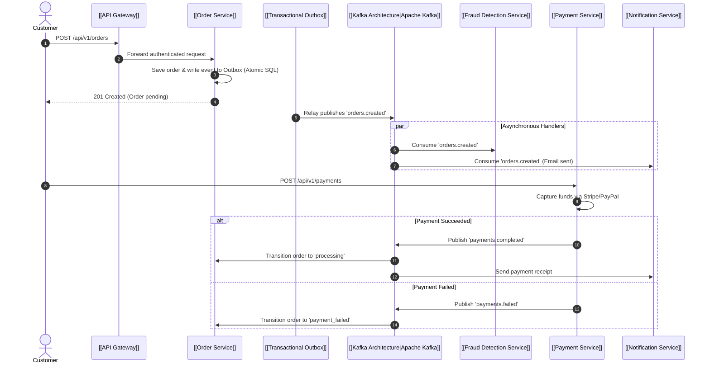

# ⚡ Event-Driven Architecture

ShopHub uses **Apache Kafka** (`kafkajs`) for asynchronous inter-service coordination, decoupled sagas, and real-time event distribution.

---

## 🔄 Order Checkout Saga Choreography

---

## 🔗 Related Documents
- [[Kafka Architecture]]
- [[Topic Catalog]]
- [[Producer Consumer Matrix]]
- [[Transactional Outbox]]
