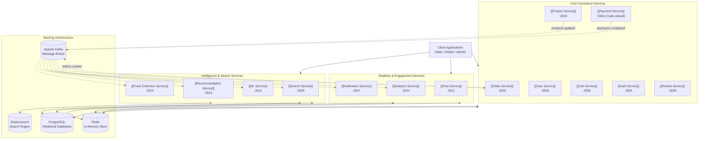

# 🏛️ System Overview

ShopHub is a distributed e-commerce platform partitioned into 14 distinct microservices. It is built using **Node.js**, **TypeScript**, and **Express.js**, with persistence handled across **PostgreSQL**, **Redis**, and **Elasticsearch**, coupled through **Apache Kafka**.

---

## 🧩 Architectural Topology

---

## 🔍 Core Domains

1. **Core Commerce**: Identity, profile management, catalog browsing, shopping cart, checkout, payments, and ratings.
2. **Intelligence & Search**: Full-text faceted queries, user behavior tracking, ML collaborative filtering, and transaction risk evaluation.
3. **Realtime & Engagement**: WebSocket buyer-seller chat, transactional emails, and platform telemetry.

---

## 🔗 Related Architecture Documents
- [[Current Architecture]] — Current state analysis and anti-patterns.
- [[Target Architecture]] — Target state blueprint and improvements.
- [[Problem Tracker]] — Registry of architectural deficiencies.
- [[Event-Driven Architecture]] — Asynchronous messaging details.
