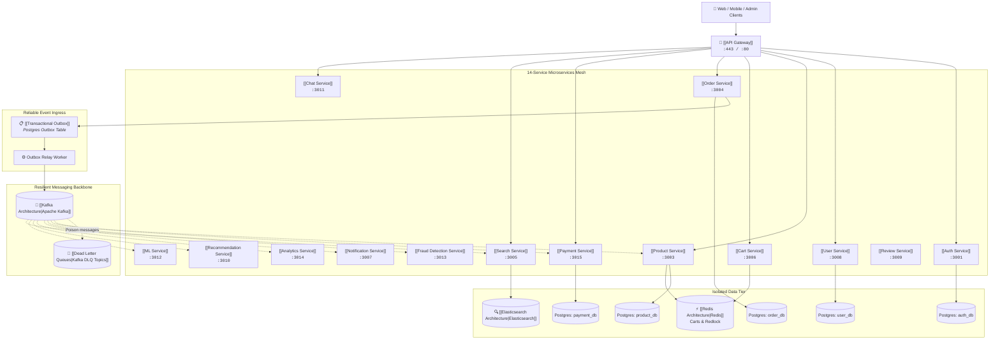

# 🎯 Target Architecture (Centerpiece Blueprint)

> [!important] Target State Definition
> **Target State**: Gateway-controlled, independently deployable microservices with isolated data ownership, reliable event publication via transactional outbox, centralized observability, resilient Kafka consumers, and reproducible containerized development.

This document represents the official architectural goal for the ShopHub platform.

---

## 🏛️ Target Architectural Topology

---

## 🛠️ Key Architectural Pillars in the Target State

### 1. Ingress & Security: [[API Gateway]]
- Single public entry point at port `443` / `80`.
- Validates JWT tokens once at the edge and forwards verified claims (`X-User-Id`, `X-User-Role`) to internal services.
- Centralizes SSL termination, CORS policies, and global rate limiting.
- Details: [[API Gateway Routes]], [[Authentication & Authorization]].

### 2. Guaranteed Delivery: [[Transactional Outbox]]
- Solves dual-write hazards in [[Order Service]] and [[Payment Service]].
- Commits state mutation and outbound message in a single atomic SQL transaction.
- Background relay worker reads `outbox_events` and publishes to Kafka with at-least-once guarantees.
- Details: [[Kafka Architecture]].

### 3. Data Ownership: [[Database Isolation]]
- Completely breaks down the shared `ecommerce_db`.
- Each service connects strictly to its own dedicated database or isolated schema with unique credentials.
- Details: [[Data Ownership Matrix]], [[PostgreSQL Architecture]].

### 4. Consumer Resilience: [[Dead Letter Queues]] & [[Retry Strategy]]
- Consumers implement exponential backoff with jitter.
- Malformed payloads are routed to a `.DLQ` topic rather than crashing service instances or dropping messages.

### 5. Flash Sale Concurrency: [[Distributed Locks]]
- Uses Redis Redlock algorithms in [[Product Service]] to prevent overselling during high-concurrency checkouts.
- Details: [[Inventory Reservation]].

---

## 🔗 Traceability to Problems & Implementation
- Problems Solved: [[Problem Tracker]], [[Critical Issues]]
- Execution Plan: [[Improvement Roadmap/Phase 1 - Critical]], [[Improvement Roadmap/Phase 2 - Infrastructure]]
