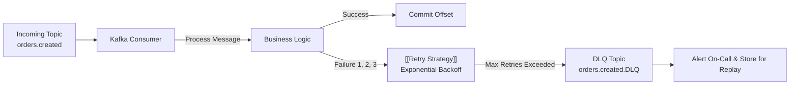

# 🛑 Dead Letter Queues (DLQ)

> [!important] Resolving REL-003
> Poison-pill messages (corrupt JSON, missing mandatory fields) currently halt Kafka consumer processing loops. Dead Letter Queues isolate failed messages for post-mortem analysis.

---

## 🔄 DLQ Routing Flow

---

## 🔗 Related Documents
- [[Retry Strategy]]
- [[Kafka Architecture]]
- [[Problem Tracker]]
