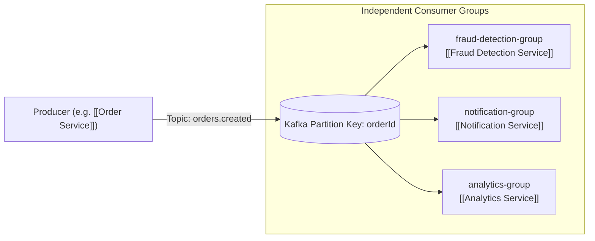

# 📡 Kafka Architecture

ShopHub relies on **Apache Kafka** (`kafkajs`) as its distributed event streaming platform.

---

## 🏛️ Broker & Consumer Group Topology

- **Broker Connection**: Default `localhost:9092` via `KAFKA_BROKERS`.
- **Consumer Group Naming**: `<service-name>-group` (e.g., `notification-service-group`, `search-service-group`).
- **Partitioning Strategy**: Keys are typically `orderId` or `userId` to guarantee in-order event processing per entity.

---

## 🔗 Related Documents
- [[Topic Catalog]]
- [[Producer Consumer Matrix]]
- [[Transactional Outbox]]
- [[Dead Letter Queues]]
- [[Retry Strategy]]
