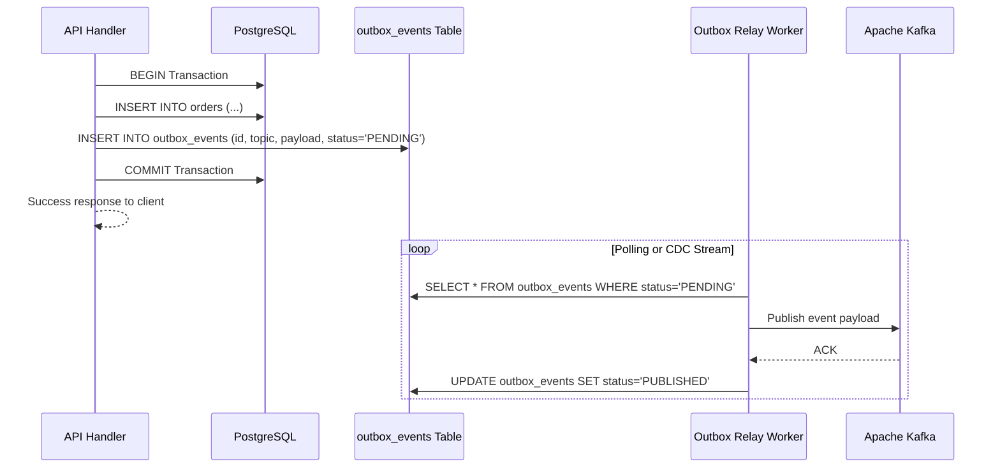

# 📋 Transactional Outbox Pattern

> [!important] Resolving ARCH-003: Silent Kafka Publish Failures
> In the current codebase, Kafka publish failures are swallowed in a `try/catch` block. If Kafka drops a connection, orders are committed to PostgreSQL without downstream events ever being emitted.

---

## 🏗️ Outbox Architecture



---

## 🗄️ Outbox Table Schema

```sql
CREATE TABLE outbox_events (
  id UUID PRIMARY KEY DEFAULT gen_random_uuid(),
  aggregate_type VARCHAR(50) NOT NULL, -- 'ORDER', 'PAYMENT'
  aggregate_id UUID NOT NULL,
  topic VARCHAR(100) NOT NULL,
  payload JSONB NOT NULL,
  status VARCHAR(20) DEFAULT 'PENDING', -- 'PENDING', 'PUBLISHED', 'FAILED'
  retry_count INT DEFAULT 0,
  created_at TIMESTAMP WITH TIME ZONE DEFAULT NOW(),
  published_at TIMESTAMP WITH TIME ZONE
);

CREATE INDEX idx_outbox_pending ON outbox_events(status, created_at) WHERE status = 'PENDING';
```

---

## 🔗 Related Documents
- [[Kafka Architecture]]
- [[Problem Tracker]]
- [[Order Service]]
