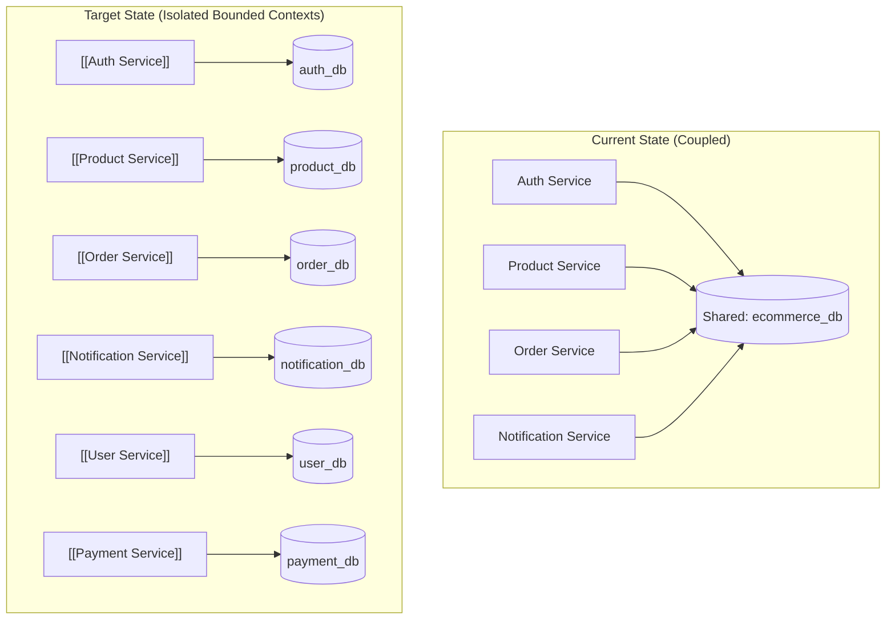

# 🛡️ Database Isolation (Resolving ARCH-004)

> [!caution] Current Anti-Pattern: Shared `ecommerce_db`
> Currently, [[Auth Service]], [[Product Service]], [[Order Service]], and [[Notification Service]] all connect to the same `ecommerce_db` database. 

---

## 🎯 Target State: Per-Service Database Isolation

---

## 🔗 Related Documents
- [[PostgreSQL Architecture]]
- [[Data Ownership Matrix]]
- [[Problem Tracker]]
