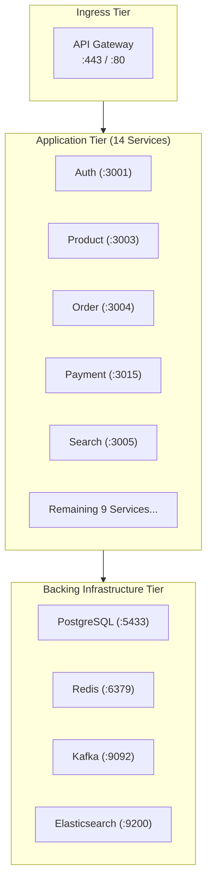

# 🐳 Docker Compose Orchestration (Resolving INFRA-001)

> [!important] Resolving INFRA-001
> There is currently no unified root `docker-compose.yml` coordinating backing services and the 14 microservices. Developers must manually launch backing databases and separate terminal sessions.

---

## 🏗️ Master Root Docker Compose Architecture

The target root `docker-compose.yml` specifies three tiers:

---

## 🔗 Related Documents
- [[Container Architecture]]
- [[Local Development Setup]]
- [[Problem Tracker]]
