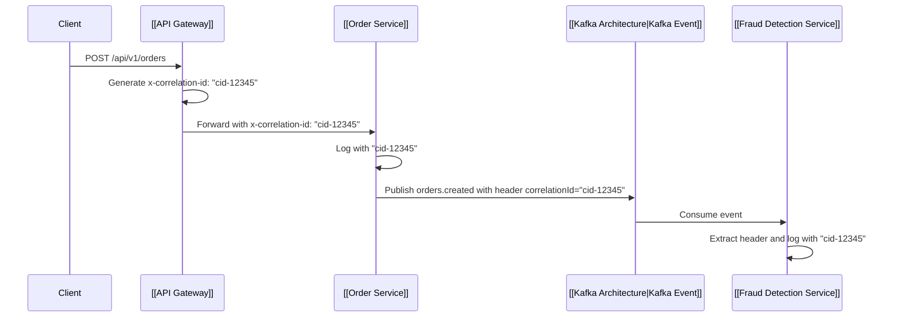

# 🆔 Correlation IDs (Resolving REL-001)

> [!important] Resolving REL-001
> In the current codebase, request cascading from HTTP through Kafka to downstream services has no shared identifier, making debugging across 14 services nearly impossible.

---

## 🔄 Correlation Propagation

---

## 🔗 Related Documents
- [[Distributed Tracing]]
- [[Monitoring & Observability]]
- [[Problem Tracker]]
