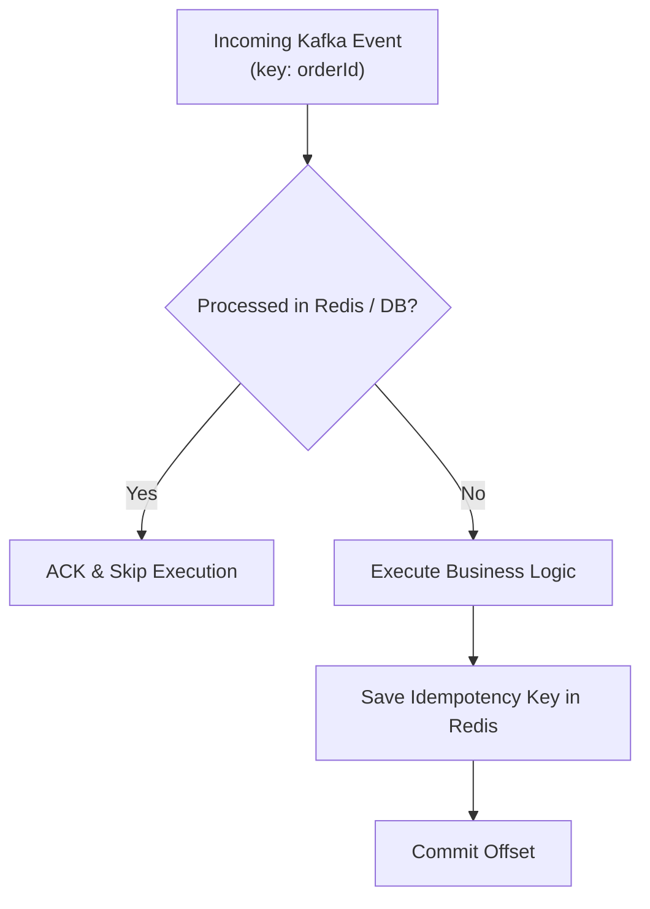

# 🔁 Idempotency Pattern

Because Kafka guarantees **At-Least-Once Delivery**, consumers can receive duplicate messages during network re-balances.

---

## 🛡️ Idempotency Verification Flow

---

## 🔗 Related Documents
- [[Payment Service]]
- [[Order Service]]
- [[Failure Handling]]
